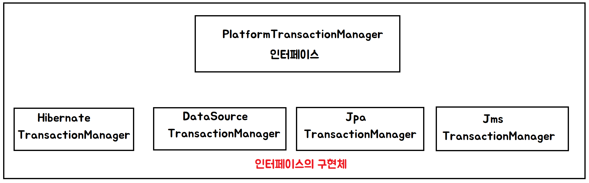
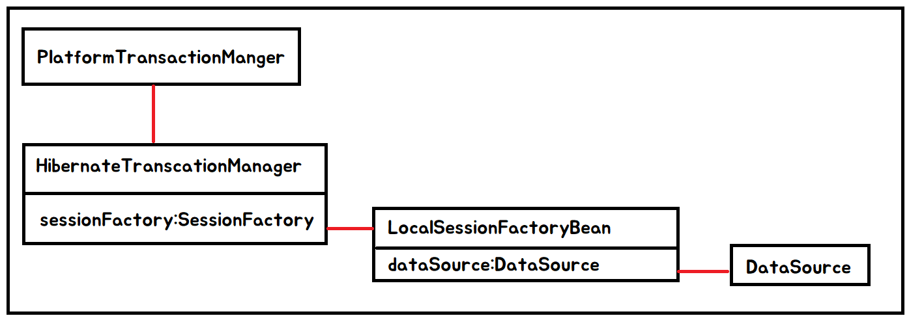

스프링 트랜잭션 기능은 전역 트랜잭션으로 동작하는 JTA (Java Transaction API) 뿐만 아니라 
JDBC, API, 하이버네이트 트랜잭션 API, JPA 트랜잭션 API를 포함한 다양한 트랜잭션 API에 대한 추상화를 제공한다
후자의 세 개 API를 로컬 트랜잭션과 함께 동작한다


전역 트랜잭션은 일반적으로 관계형 데이터베이스와 메시지 큐(JMS) 같은 다양한 트랜잭션 자원과 함께 동작한다


JTA 로 전역 트랜잭션을 관리하는 것은 애플리케이션 서버이다

반면에 예를 들어 JDBC 커넥션과 관련된 트랜잭션인 로컬 트랜잭션은 자원에 한정적이다

로컬 트랜잭션은 다양한 자원들과 함께 동작할 수 없다

---

스프링 트랜잭션은 프로그래밍적 트랜잭션과 선언적 트랜잭션 관리를 모두 지원한다


스프링의 TransactionManager API 로 트랜잭션을 프로그래밍적으로 관리하거나 PlatformTransactionManager API로 직접 관리 할 수 있다

선언적적 트랜잭션 관리는 @Transactional 어노테이션을 트랜잭션 관리가 필요한 클래스 또는 메소드에 적용할 수 있다

스프링의 선언적 트랜잭션 관리의 구현은 스프링의 AOP 프레임웤크를 기반으로 하며, 이것은 전역 또는 로컬 트랜잭션을 위한 모든 환경에서 동작한다


# 프로그래밍적 트랜잭션 관리
###PlatformTransactionManager 인터페이스
```java
public interface PlatformTransactionManager {

    // TransactionDefinition 로 부터 TransactionStatus 를 얻을 수 있다
    TransactionStatus getTransaction(TransactionDefinition definition) throws TransactionException;
    
    // 반환 TransactionStatus을 가지고 커밋을 할 지, 롤 백을 할 지 정한다
    void commit(TransactionStatus status) throws TransactionException;
    void rollback(TransactionStatus status) throws TransactionException;
}
```



# 선언적 트랜잭션 관리
[AppConfig.java](./app/messages/config/AppConfig.java)
```java
@Configuration
@EnableTransactionManagement
public class AppConfig {

    private DataSource dataSource;

    public AppConfig(DataSource dataSource) {
        this.dataSource = dataSource;
    }
    @Bean
    public FilterRegistrationBean<AuditingFilter> auditingFilterFilterRegistrationBean() {
        FilterRegistrationBean<AuditingFilter> registraion = new FilterRegistrationBean<>();
        AuditingFilter filter = new AuditingFilter();
        registraion.setFilter(filter);
        registraion.setOrder(Integer.MAX_VALUE);
        registraion.setUrlPatterns(Arrays.asList("/messages/*"));
        return registraion;
    }

    // 하이버네이트에 DataSource 를 주입해준다
    @Bean
    public LocalSessionFactoryBean sessionFactory() {
        LocalSessionFactoryBean sessionFactoryBean = new LocalSessionFactoryBean();

        sessionFactoryBean.setDataSource(dataSource);
        sessionFactoryBean.setPackagesToScan("page_135.app.messages");
        return sessionFactoryBean;
    }
    
    // 하이버네이트 트랜잭션 설정
    @Bean
    public HibernateTransactionManager transactionManager() {
        HibernateTransactionManager transactionManager = new HibernateTransactionManager();
        transactionManager.setSessionFactory(sessionFactory().getObject());
        return transactionManager;
    }
}
```

