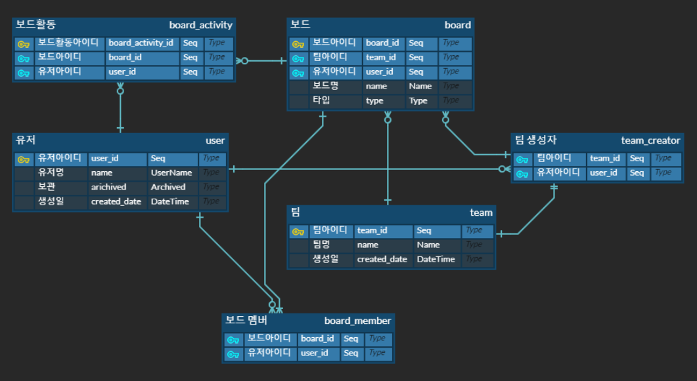

>###데이터 모델링 - 애플리케이션의 기반 설계하기

1. 데이터 모델링의 기초
2. 데이터 모델리의 목적
3. ER 다이터그램을 사용한 개념적 데이터 모델링
4. 논리적 데이터 모델링
5. RDBMS를 위한 물리적 데이터 모델링
6. 몽고 DB(=No SQL)를 위한 물리적 데이터 모델링
---
### 데이터 모델링 단계와 산출물
데이터 모델링은 일반적으로 세 단계로 구성된다

- 개념적 데이터 모델링
    - ER(Entity-Relationship) 다이어그램으로 표현
    - 

- 논리적 데이터 모델링
    - 사용자가 몇개의 팀까지 생성할 수 있나?
    - 사용자가 팀을 생성해야 합니까?
    - 팀을 생성하는 것 외에 다른 사용자가 생성한 팀에 참여할 수 있나?
    - 참여할 수 있다면 몇개의 팀까지 사용자가 참여할 수 있나?
    - 사용자가 다른 팀에서 이미 사용 중인 이름의 팀을 생성할 수 있나?
    - <u>팀 이름을 어떻게 식별할 수 있나?</u>
     
       
    정규화는 중복과 예외를 제거하고 데이터의 의존성을 확인하는 프로세스다
    비정규화는 정규화의 반대이며, 주로 성능 개선을 위해 사용된다
- 물리적 데이터 모델링
    - 데이터 베이스에 반영

---
### 데이터 모델링에서 사용되는 용어
|용어|내용|
|---|---|
|엔티티|테이블명, 객체명|
|속성|Column의 속성, varchar, default, unique, not null|
|관계|1:1 관계 / 1:N 관계 / N:1 관계 / N:N 관계 |
|기본키|id 또는 식별값 - index 또는 uuid|
|외래키|관계를 맺기 위한 키|

 

## 서브 타입과 수퍼 타입
- 데이터 모델링에서 서브타입(subtpyes)과 수퍼타입(supertypes)은 공통 속성을 공유하며, 수퍼 타입과
다른 엔티티 간의 관계는 서브 타입에도 적용 될 수 있다. 이 규칙을 사용해 두 유형의 엔티티가 서브 타입과 수퍼 타입인지를 확인하기 위해 테스트 할 수 있다.
Personal Board 와 Team Board 를 이용하면 그것들이 Board 의 서브타입인지를 알 수 있다. 그리고 이 규칙으로 Team Creator 를 테스트하면
그것이 User 의 서브타입이 아님을 알 수 있다.

 

## 논리적 데이터 모델링

######그림 5.20
위 그림은 User 와 Team 의 관계설정이다

######그림 5.21
개념적 데이터 모델에서 Board의 서브 타입으로 Personal Board 와 Team Board 를 가진다.

여기에는 Board만 있다. Board 엔티티에서는 Personal Board 와 Team Board 를 구분하기 위해 Type 속성을

추가하고 User 엔티티와 Board 엔티티 간의 관꼐를 생성하기 위해 외래 키인 User ID 를 추가한다.

그리고 외래 키인 Team Id는 Team엔티티와 Board 엔티티 간의 일대다 관계를 구축한다.

Board 엔티티와 Team Creator 엔티티 모두 팀을 생성한 사용자를 식별하는 데 사용할 수 있는 외부키 

Team Id 와 외부키 User Id 를 가지는 것을 볼 수 있다.

<u>그러나 이 논리적 데이터 모델을 기반으로 보드를 추가하는 사용자가 반드시 팀의 생성자일 필요는 없다. 누구든 될 수 있다

데이터베이스 레벨에 팀 샘성자만 보드를 추가할 수 있는 제약 사항을 적용하려면 아래와 같은 그림처럼 설계 해야 한다</u>

######그림 5.22

보다시피 Team Creator 엔티티에 ID 속성을 추가하고 Board 엔티티에 외래 키인 Team Creator ID를 추가한다

이렇게 하면 모든 보드가 Team Creator 에 의해 생성될 것이다.

<u>그러나 이렇게 하면 다른 팀 멤버가 보드를 생성하도록 허용해야 할 때 재작업을 해야 할 수도 있다</u>

그림 `5.21` 의 설계는 확장성을 제공해 이러한 관점에서 더 나은 설계가 가능하게 해준다.

`트레이드 오프 (tradeoff)`로 애플리케이션 코드에서 제약사항을 적용할 수 있다.

<u>Board 엔티티에서 Team Creator Id 를 사용하지 않아야 하는 또 다른 이유는 테이블을 조인해 User ID 별로 보드를 조회할 것이기 때문이다</u>

그림 `5.21` 에서 Personal Board 는 Team Id 속성 값에 null 이 허용된다

외래 키는 null이 허용된다. 외래 키는 null 값을 가질 수 있다.

다음 그리음 `5.23` 은 Board, Board Member, Board Activity, User 엔티티를 사용한 논리적 데이터 모델이다

######그림 5.23

Board Member 에서 외래 키인 Board Id 와 User Id 는 Board Member 를 고유하게 식별하는 데 사용

할 수 있는 복합 키를 형성한다. 여기서는 Board Activity 엔티티에서 이 복합키를 사용한다.

Board Activity 엔티티와 User 엔티티 간의 관계는 1:N 관게다. 이 관계는 똑같이 1:N 관계를

가지는 Board Activity 엔티티와 Board Member 엔티티의 개념적 데이터 모델에서의 경우와는 다르다.

복합 키를 사용해 이러한 조정을 하는 이유는 Board Activity 가 BoardMember 를 식별하는 데 사용할 수 

있는 복합 키인 Board Id 속성과 User Id 속성을 이미 가지고 있으므로, Board Member 에 기본키 Id 를 추가해서

Board Activity 에서 그 기본 키를 사용하기를 원하지 않기 때문이다.

그리고 개념적 데이터 모델에서 Board Member 는 Card List, Card, Comment, Attachment,

Card Activity 와 관계를 가진다. 같은 이유로 복합 키인 <Board Id 와 User Id> 를 사용해 이러한 관계를 구축할 것 이다.

다음 그림 5.24는 Card 와 Card List, 그리고 관련된 엔티티를 사용한 논리적 데이터 모델이다.

######그림 5.24
 
보다시피 이 다이어그램에서 Card List, Card, Attachment, Card Activity, Assignment, Comment

엔티티는 <u>Board Member 복합키  (Board Id와 User Id)를 사용한다</u>

그러나 이로 인해 주로 Board Id 가 데이터 중복을 일으킨다. 

Board Id 가 중복되는 이유는 그것이 다른 속성에서 파생될 수 있기 때문이다

예를 들어 Card 엔티티의 Board Id 는 Card 엔티티의 Card List Id 를 통해 Card List 엔티티에서 파생될 수 있다.

이 설계로 인한 또 다른 이슈는 가령 미래에 보드 간에 카드를 이동 시키는 것과 같은 기능을 구현해야 할 때

<u>모든 엔티티에서 Board Id 를 모두 업데이트 해야 하므로 성능 이슈 뿐만 아니라 데이터 불일치도 발생할 것이라는 점이다</u>

향후 이러한 문제를 해결하려는 노력이 상당이 많이 들 것이다.

따라서 Card, Attachment, Card Activity, Assignment, Comment 에서 Board Id 를 제거해 보자. 

이렇게 하면 이 엔티티에 User Id 가 남게 된다. 그리고 Board Member 와 엔티티 간의 관계는 User 엔티티로 이동한다

이로 인해 보드 멤버만 이 애플리케이션 코드에서 수행할 수 있는 제약사항을 적용해야 한다.

이러한 조정을 통해 데이터 모델은 중복 Board Id 가 없고 확장 가능해진다.

<u>그림 5.24 에서 보다시피 제거한 후 복원을 지원해야 하는 엔티티에 Archived 속성을 추가한다.

즉, 카드를 보관하면 Archived 속성 값이 true 가 되고 UI에 해당 카드는 표시되지 않는다.

그리고 보드 멤버는 해당 보드의 활동 리스트에서 제거한 카드를 복원할 수 있다. (=deleted)</u>

Board Id 를 제거하기 전에 한 가지가 더 살펴볼 것이 있다. 보드 활동, 카드활동, 보드 활동 보기 사용자 스토리를 다음을 통해 계속해서 살펴보자

*보드 멤버로서, 나는 해당 보드에서 어떤 일이 발생했는지 이해 할 수 있도록 해당 보드의 모든 활동을 볼 수 있다*

이 설명은 모호하다. 모든 활동에 포함되는 것은 무엇인가? 이것을 구체적으로 명시해야 한다.

이 때가 바로 데이터 모델을 설계하는 사람이 비지니스 전문가와 심층적인 논의를 가져야 할 때다

- 보드 생성하기
- 보드에 멤버 추가하기
- 카드 리스트 생성하기
- 카드 리스트 이름 수정하기
- 카드 리스트 보관하기
- 카드 추가하기
- 카드 제목 수정하기
- 카드를 멤버에서 할당하기
- 카드 이동하기
- 카드 보관하기
- 카드 삭제하기
- 카드 첨부파일을 추가하기
- 카드 보관하기
- 카드 삭제하기
- 카드 첨부파일 추가하기
- 카드 첨부파일 삭제하기
- 카드 댓글 추가하기
- 카드 댓글 편집하기
- 카드 댓글 삭제하기

그리고 Board Activity 를 사용해 `보드 생성하기`와 `보드에 멤버 추가하기`를 이전 목록에 추가하면 카드 리스트로

이러한 활동을 참조 할 수 있는 새로운 유형의 엔티티인 Card List Activity 가 필요하다

이 방법으로 Board Activity, Card List Activity, Card Activity 라는 세 가지 유형의 엔티티를 가지게 된다.

<u>이러한 구분으로 Board Member 가 해당 Board 의 모든 Board Activity 을 볼 수 있도록 목록을 렌더링 하기 위해
 
세 개의 엔티티에서 데이터를 가져와야 할 때 문제가 발생할 수 있다. 예를 들어 기본적으로 보드 멤버가 최근 15개만 결과로 반환해야 한다.

이것은 여전히 관리가 가능한 것처럼 보인다.

하지만 16에서 30까지의 활동을 어떻게 가져올 수 있을까?

구현과 성능 이슈의 복잡성은 잘못된 데이터 모델 설계의 징표이다</u>

######그림 5.25

<u>여기서는나열된 모든 활동과 ㅏㅋ드 댓글을 저장하는 Activity 엔티티를 소개한다.

이렇게 해서 카드 활동과 카드 댓글을 훨씬 간단한 쿼리로 같은 시간대에 렌더링 할 수 있다</u>

Activity 엔티티의 Type 속성은 레코드가 활동 로그인지 또는 카드 댓글인지를 나타내느 데 사용된다.

Card Id 속성은 외래 키이며 활동이 카드와 관련이 없다면 이 속성의 값은 null 이다.

Detail 속성은 JSON 포맷으로 저장된 세부 사항 데이터를 포함한다. 여기서는 모든 활동과 카드 댓글을
 
저장하기 위해 Activity 엔티티를 사용하기 때문에 Comment 엔티티가 필요하지 않다.

<u>그림 5.26 에서 보듯이 모든 엔티티를 하나의 다이어그램에 넣어보자. 그리고 이 버전에서는 Team 엔티티에

외래 키 User Id 를 추가하고 Team Creator 엔티티를 제거한다. 그 이유는 Team 엔티티와

Team Creator 엔티티가 1:1 관계이고 UserId 이외에 다른 추가 속성이 없기 떄문이다.

이 변경으로 얻는 한 가지 이점은 User Id 별로 팀을 조회할 때 테이블 조인을 피할 수 있다.</u>

보다시피 개념적 데이터 모델과 논리적 데이터 모델에는 많은 차이점이 있다.

<u>개념적 데이터 모델에서 가지고 있는 제약 사항 중 일부는 테이블 조인을 줄여 

성능 향상과 설계의 확장성을 가질 수 있도록 애플리케이션의 코드로 옮겨야 한다</u>

###### 완성된 논리적 데이터 모델

